# MarbleMind  
**Two-Player Counterclockwise Marble Game**  

## Table of Contents  
1. [Project Overview](#project-overview)  
2. [Demo and Screenshots](#demo-and-screenshots)  
3. [Code Structure](#code-structure)  
4. [Approach](#approach)  
5. [Libraries and Frameworks](#libraries-and-frameworks)  
6. [Installation and Setup](#installation-and-setup)  
7. [Usage Instructions](#usage-instructions)  
8. [Testing](#testing)  
9. [Troubleshooting](#troubleshooting)  
10. [Future Enhancements](#future-enhancements)  
11. [Acknowledgements and Credits](#acknowledgements-and-credits)  
12. [Appendices](#appendices)  

---

## Project Overview  
### Introduction  
The **Two-Player Counterclockwise Marble Game** is a digital, turn-based strategy game played on a 4x4 grid. Players alternate placing marbles with the goal of aligning four consecutive marbles in a row to win. Each turn triggers a counterclockwise movement of all marbles, introducing a unique gameplay mechanic.  

### Features  
- 4x4 grid gameplay for two players.  
- Counterclockwise marble movement after every turn.  
- Dynamic UI with interactive elements.  
- Automatic win-condition checks.  
- Timer for each round to maintain gameplay pace.
- Post-winning dialog box: At the end of the game, players can choose to "Play Again" or "Quit" with a confirmation dialog.
- Rules Dialog: Accessible from the main menu, explaining the game's rules.

### Target Audience  
This project is for casual gamers and developers interested in exploring game logic and Flutter app development.  

---

## Demo and Screenshots  

### Demo Video  

Click below to watch the game in action:  

[https://github.com/user-attachments/assets/3f1cfa63-17b5-43b4-b0db-f7181bf61ac5](https://github.com/user-attachments/assets/b52238af-8a54-4301-b045-712ff870e1aa)

### Screenshots  


#### Home Screen  
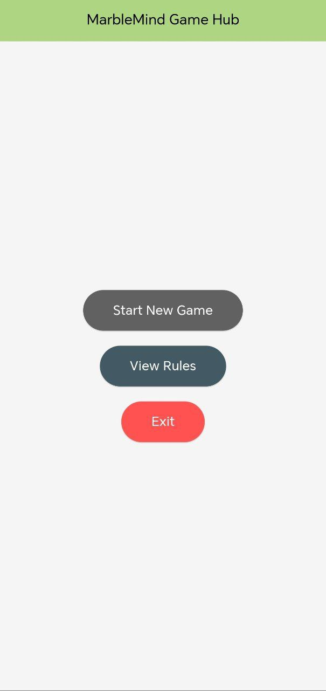 

#### Rules
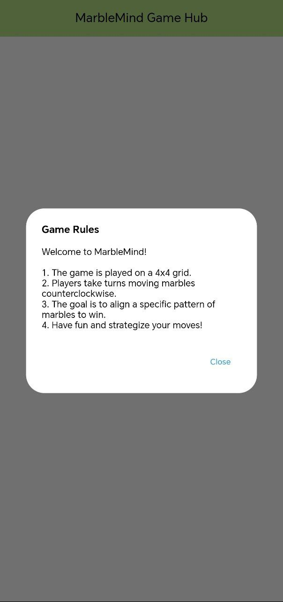  

#### Gameplay  
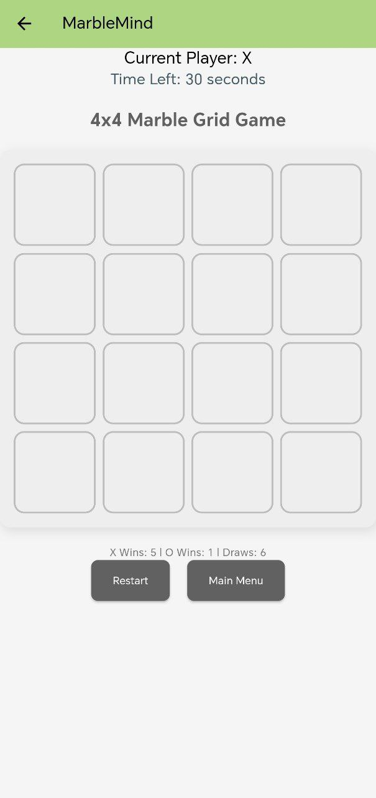  
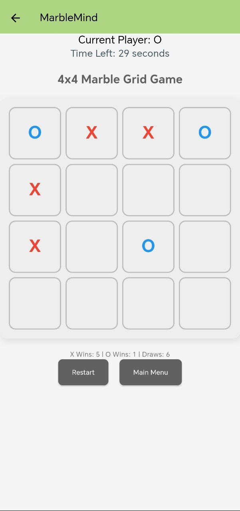  
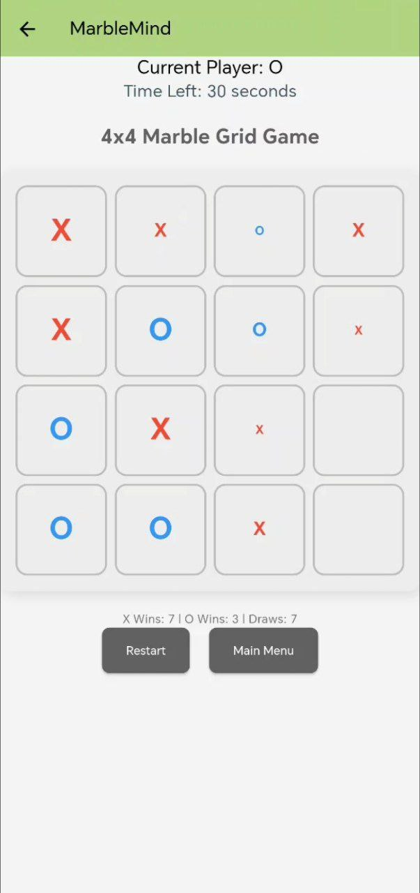  

#### Win Condition  
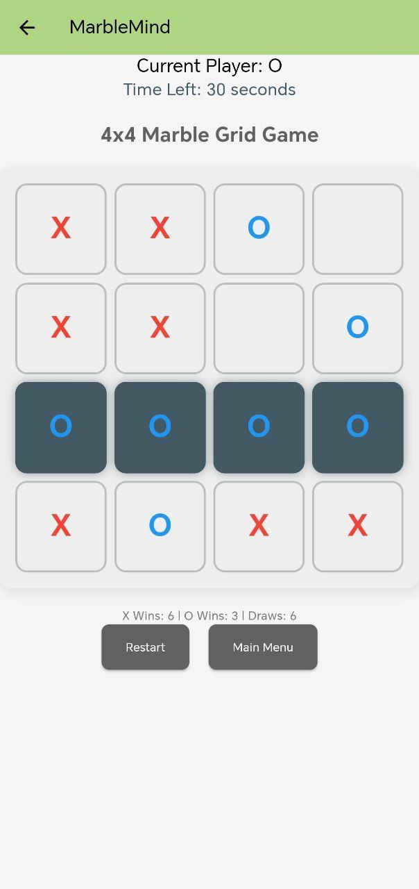  
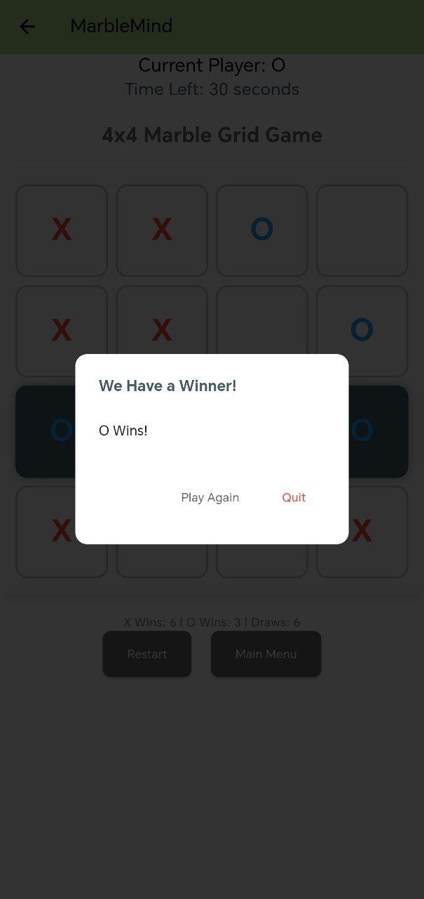  
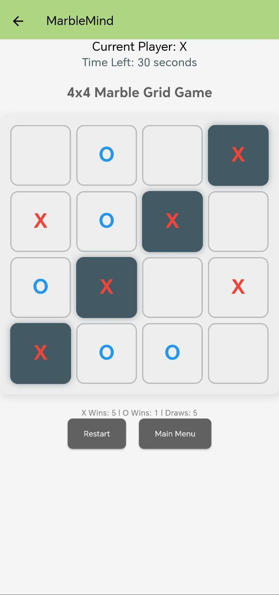  
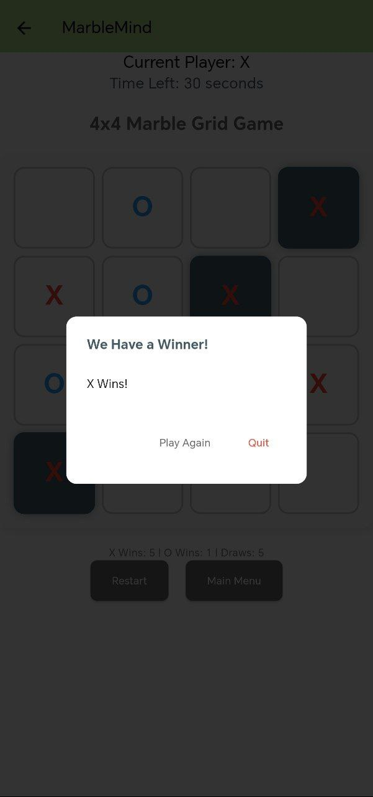  
 

#### Draw Condition  


#### Dialog boxes
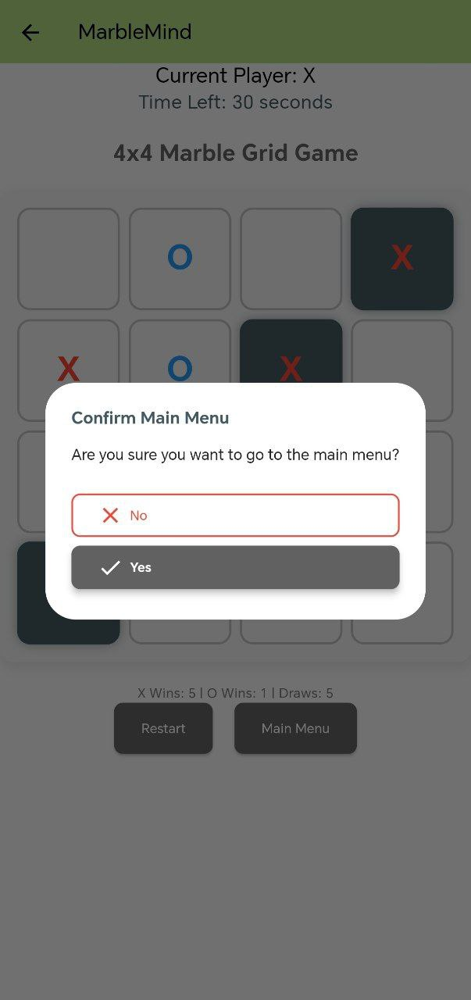 
 
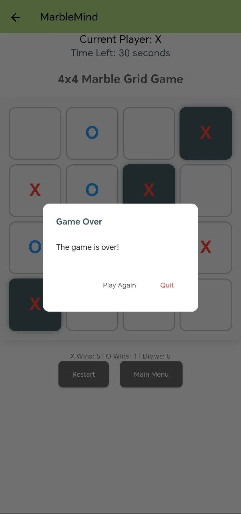 
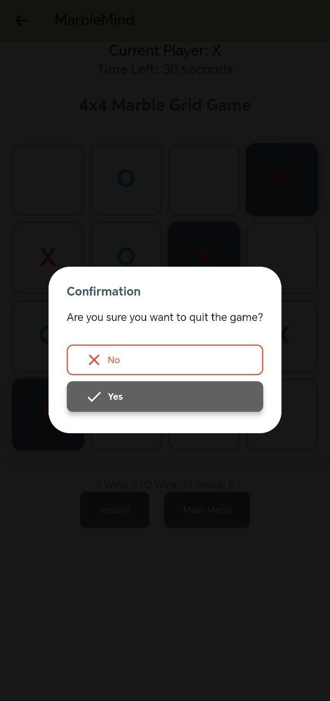 


---

## Code Structure  
### Directory Layout  
- `/src`: Source code files.  
- `/assets`: Static files such as images and icons.  
- `/lib`: Libraries and reusable components.  
- `/test`: Test cases and scripts.  

### Key Files  
- **`main.dart`**: Initializes the game UI and logic.  
- **`game_logic.dart`**: Core game logic for marble placement, movement, and win checks.  
- **`board_widget.dart`**: Manages the grid's visual representation and handles user input.  

---

## Approach  
### Problem Definition  
The game adds strategic depth to a classic two-player board game by introducing counterclockwise marble movement.  

### Design Choices  
- **Architecture**: Implements MVVM (Model-View-ViewModel) for separation of concerns.  
- **State Management**: To Handle game state, including player turns and marble positions.  

### Algorithm Overview  
- **Counterclockwise Movement**: Marbles shift one position counterclockwise after each turn.  
- **Win Condition**: The game checks for four consecutive marbles in any row, column, or diagonal after every move.  

---

## Libraries and Frameworks  
### Dependencies  
- **Flutter (v3.10.5)**: Cross-platform development framework.  
- **VS Code**: Lightweight IDE with Flutter plugins.  
- **Android Studio & ADB**: For Android-specific development and debugging.  

---

## Installation and Setup  
### Prerequisites  
- [Flutter SDK](https://flutter.dev/docs/get-started/install)  
- An IDE like VS Code or Android Studio  


### Steps  
1. Clone the repository:  
   ```bash
   git clone https://github.com/harshagnihotri10/MarbleMind
   ```  
2. Navigate to the project directory:  
   ```bash
   cd project_directory
   ```  
3. Install dependencies:  
   ```bash
   flutter pub get
   ```  
4. Run the application:  
   ```bash
   flutter run
   ```  

---

## Usage Instructions  
### Running the Application  
- Start the app with:  
  ```bash
  flutter run
  ```  

### Key Functionalities  
1. **Start Game**: Click "Start New Game" on the home screen.  
2. **Place Marbles**: Tap an empty cell to place your marble.  
3. **Counterclockwise Movement**: Watch marbles shift after each turn.  
4. **Win Check**: The game announces the winner upon meeting the win condition.  

---

## Testing  
### Testing Strategy  
- **Unit Tests**: Validate core game logic.  
- **Integration Tests**: Ensure UI reflects the game state accurately.  

### Test Execution  
Run all tests with:  
```bash
flutter test
```  

---

## Troubleshooting
### Common Issues  
- **App crashes on launch**: Verify that Flutter SDK is correctly installed and up to date.  


## Future Enhancements  
- Add AI for single-player mode with varying difficulty levels.  
- Implement a game history view to review past moves and outcomes.  

---

## Acknowledgements and Credits  
- **Flutter**: For its cross-platform development capabilities.  


---

## Appendices  
### Code Snippets  
**Example: Counterclockwise Movement Logic**  
```dart
 void shiftAllMarblesCounterclockwise(List<List<Cell>> grid, int excludeRow, int excludeCol) {
    // Directions for counterclockwise movement (up, left, down, right)
    List<List<int>> directions = [
      [-1, 0],  // up
      [0, -1],  // left
      [1, 0],   // down
      [0, 1]    // right
    ];

```  

### Glossary  
- **State Management**: Reactively updating the UI based on application state.  
- **Counterclockwise Movement**: Marbles shift one position counterclockwise after each turn.  
